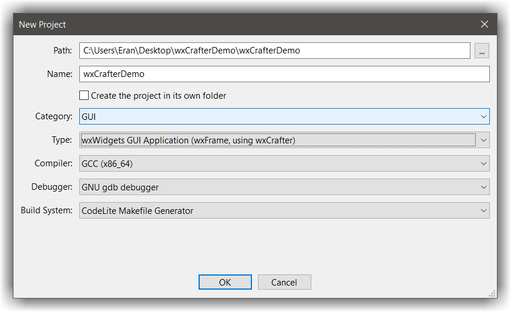
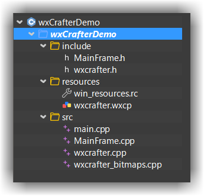
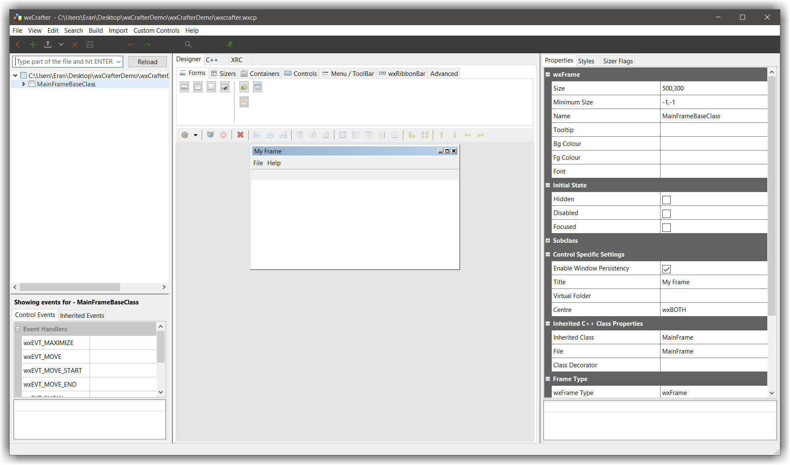
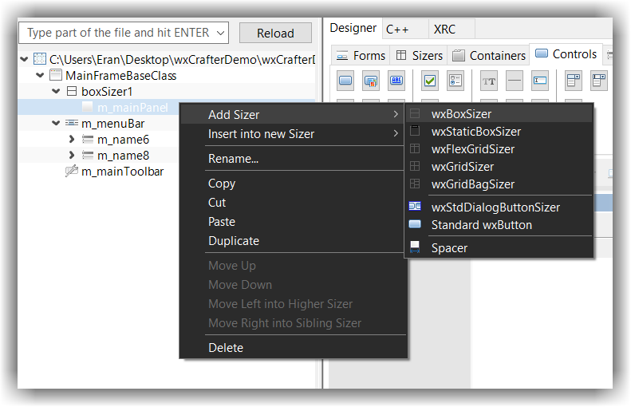
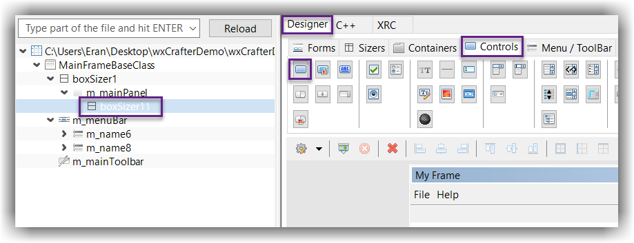
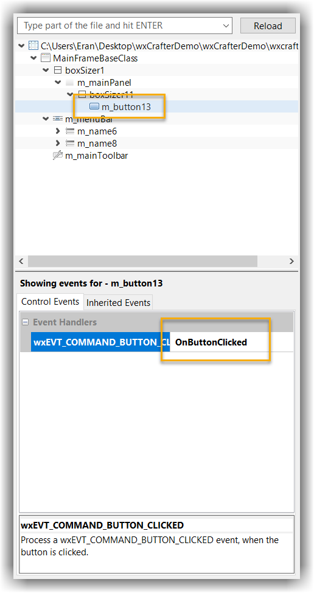
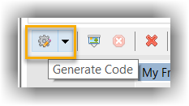
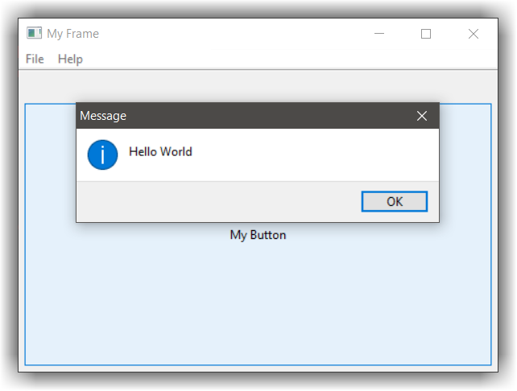

# wxCrafter
---

## About
---

wxCrafter is a RAD plugin for developing wxWidgets UI applications. You should have a basic knowledge of wxWidgets. See [here][1] and [here][2]
for some information on wxWidgets. In this tutorial, we will create a simple wxDialog with a "Hello World" button and connect an event to it. 

## Hello World
---

- Create an empty workspace from `File` &#8594; `New` &#8594; `New Workspace`
- Select `C++`
- Set the workspace path and name and click `Ok`
- Right click on the workspace and select `New` &#8594; `New Project`
- Set the project category to `GUI`
- Set the project name `wxCrafterDemo`
- Set the project type to `wxWidgets GUI Application (wxFrame using wxCrafter)`
- Click `Ok`
- Right click on the newly added project, open the settings dialog and mark this project as `GUI` from `Project Settings` -> `General` -> `This program is a GUI application`




The following table gives a brief description about the generated files:

File name | Description
----------|--------------
main.cpp | The application code (derived from wxApp)
MainDialog.cpp / h | The inherited code for the dialog. This is where you should place your code
wxcrafter.cpp | The generated code by wxCrafter - you should not modify anything in this file as it will be overwritten by wxCrafter
wxcrafter_bitmaps.cpp | The bitmaps code. wxCrafter converts every bitmap selected in the designer into C++ code so they will be available during runtime
wxcrafter.wxcp | This is the wxCrafter designer file. Double-clicking it will open it in an editor

- Double click on the `wxcrafter.wxcp` file, this will open the designer



Now, what we would like to do is: 

- Add a button 
- Connect an event to the button so when the button is clicked, we will be prompted with `Hello world` message

Since controls can only be placed inside sizers:

- Right click `m_mainPanel` entry from the tree view and select `Add Sizer` &#8594;  `wxBoxSizer`



- **Select the newly added sizer, this tells wxCrafter where to add new controls**
- From the main view, Select the `Designer` &#8594; `Controls` tab, and click on the `wxButton` button



- Expand the button so it will capture the entire `m_mainPanel` area: 
    - Select the button in the tree view (by simply clicking it)
    - Clicking on both the `Set sizer proportion to 1` and `Expand Item` buttons (see screenshot below)


- Select the button and add function for the `wxEVT_COMMAND_BUTTON_CLICKED` named `OnButtonClicked`



- Save everything and click on the grey cog button to generate the code



- Open the file `MainFrame.cpp` within CodeLite
- You should see a new function added at the bottom with this code:

```c++
void MainFrame::OnButtonClicked(wxCommandEvent& event)
{
}
```

- Change it to

```c++
void MainFrame::OnButtonClicked(wxCommandEvent& event)
{
    wxUnusedVar(event);
    wxMessageBox("Hello World");
}
```

and add this include somewhere to the top of this file:

```c++
#include <wx/msgdlg.h>
```

- Build the project by clicking ++f7++
- Run the project ++ctrl+f5++
- Clicking on the button displays the `Hello World` message box



## Project settings
---

When selecting the root item in the tree view of wxCrafter, you can alter the various wxCrafter project settings

Property name | Description
--------------|----------------
Output directory | this tells wxCrafter where to place the generated files. If the path set is relative, it will be relative to the current wxcp file 
Output File Name|the name of the file to use for the base classes. By default, it will use the base name of the current wxcp file
Additional Include Files|provide a list of files that should be included in the generated files. The format is "MyFile.h";"AnotherHeader.h"
Bitmaps File|Set here the name of the file for the project bitmaps. wxCrafter converts all selected bitmap files into a C array and embed them into the executable. This file contains these arrays
Generate Window ID|When setting this to True, wxCrafter will treat any unrecognized Window ID as a enumerator and will place it as member of the relevant class. So if you set a Window ID for a control to be something like ID_MY_BUTTON, wxCrafter will create an enum with ID_MY_BUTTON as one of its enumerators
First Window ID|The initial value for the Window ID enum 


 [1]: https://www.wxwidgets.org/docs/tutorials.htm
 [2]: https://www.wxwidgets.org/docs/tutorials/hello.htm
 